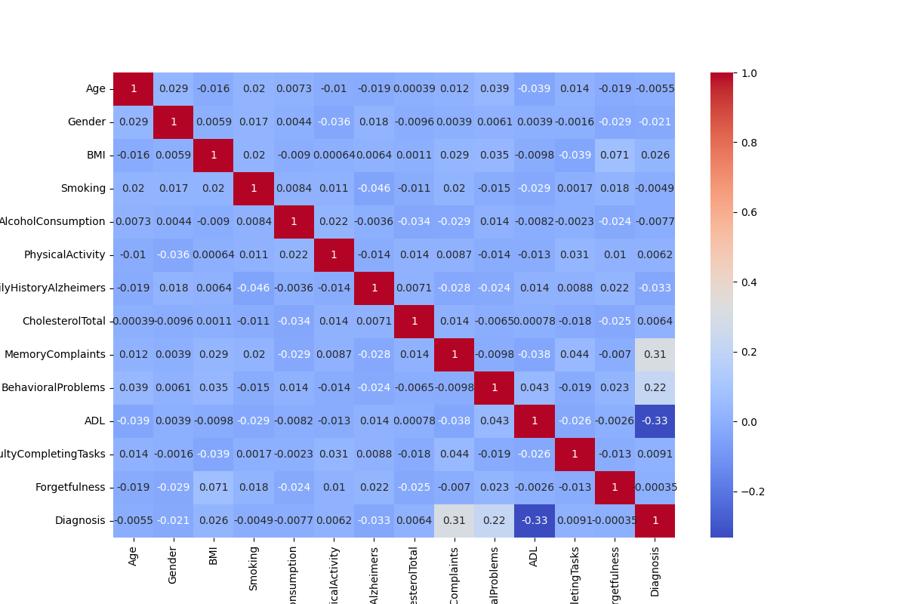
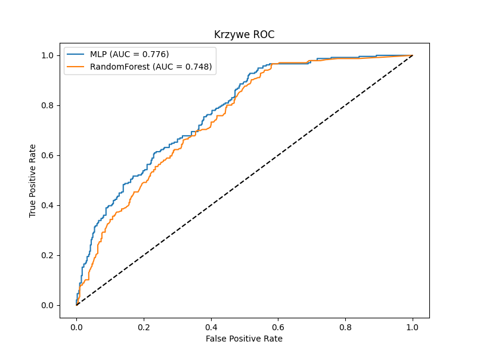
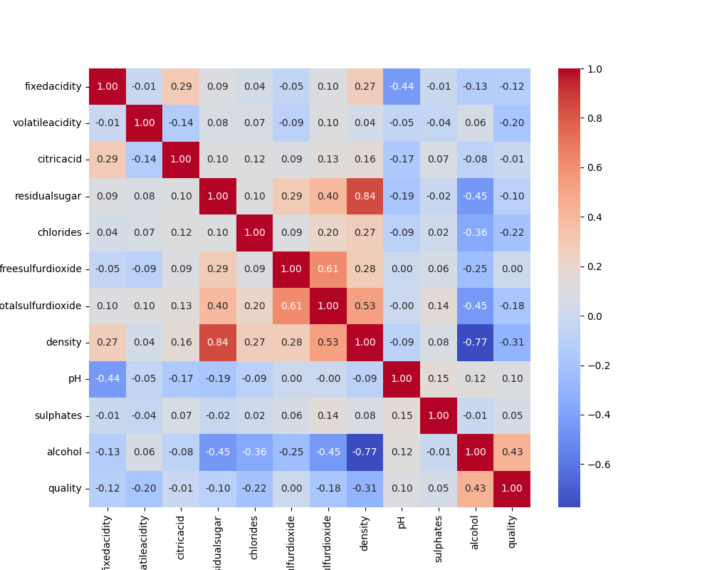
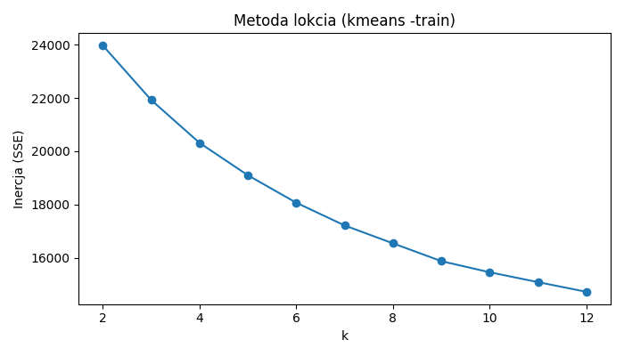
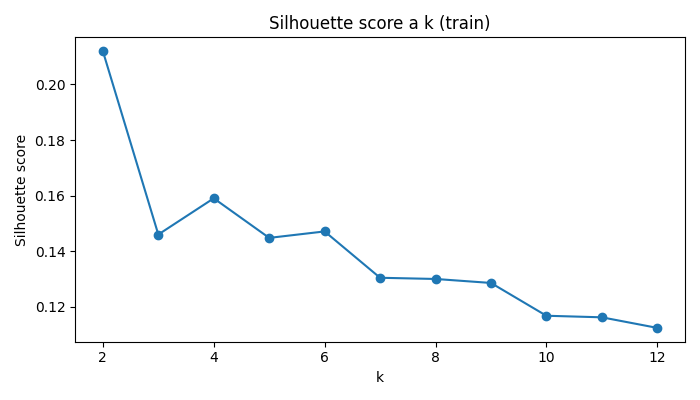

# ML & Data Analysis Projects

University projects in data analysis and machine learning. Classification, clustering, EDA - all in Python with scikit-learn.

| Project | What it does | Models |
|---------|-------------|--------|
| [Alzheimer Disease](#alzheimer-disease-prediction) | Predicts Alzheimer's from patient health data | MLP, Random Forest |
| [White Wine Quality](#white-wine-quality) | Predicts wine quality score + groups wines by chemistry | Random Forest, KMeans |
| [Telco Clustering](#telco-customer-clustering) | Segments telecom customers into groups | KMeans, Hierarchical |

---

## Alzheimer Disease Prediction

**Folder:** [`/AlzheimerDisease`](./AlzheimerDisease) · **Dataset:** [Kaggle](https://www.kaggle.com/datasets/rabieelkharoua/alzheimers-disease-dataset) (2,149 patients, 14 features)

Binary classification - does the patient have Alzheimer's or not? Two models compared: MLP neural network and Random Forest.

Picked 6 predictors based on correlation + medical reasoning. ADL (-0.33), MemoryComplaints (+0.31), and BehavioralProblems (+0.22) had the strongest link to diagnosis. Also included Age, FamilyHistoryAlzheimers, and DifficultyCompletingTasks for their clinical relevance despite weaker statistical correlation.

<p align="center">
  
</p>

| Metric | MLP | Random Forest |
|--------|-----|---------------|
| Accuracy | **0.72** | 0.68 |
| Specificity | **0.86** | 0.77 |
| Sensitivity | 0.48 | **0.53** |
| AUC | **0.776** | 0.748 |

<p align="center">
  
</p>

**MLP wins.** Random Forest hit ~0.998 accuracy on training data but dropped to 0.68 on test - classic overfitting. MLP generalized better (smaller train-test gap, higher AUC). Both models struggle with sensitivity though - too many false negatives, which in a medical setting means missed diagnoses.

📄 [Detailed report](./AlzheimerDisease/report.pdf)

---

## White Wine Quality

**Folder:** [`/Wine`](./Wine) · **Dataset:** UCI Wine Quality (3,934 wines, 12 features)

Two-part analysis: (1) Random Forest to predict expert quality rating (1-7), (2) KMeans to find natural groupings among wines.

The biggest driver of quality turned out to be alcohol content (+0.43 correlation), followed by density (-0.31) and chlorides (-0.22). No missing values, 645 duplicates kept (different wines can have identical chemistry).

<p align="center">
  
</p>

**Classification results (test set):**

| Metric | Value |
|--------|-------|
| Accuracy (exact) | 0.6579 |
| Accuracy ±1 | **0.9670** |
| MAE | 0.3785 |

97% of predictions are off by at most 1 quality level - not bad for a 7-class problem.

**Clustering** found 2 natural groups (best k=2 by silhouette score):
- **Cluster 0** - heavier wines: more sugar, higher density, more sulfur dioxide, less alcohol. Average quality 3.57.
- **Cluster 1** - lighter wines: less sugar, lower density, more alcohol. Average quality 4.06.

<p align="center">
  
  
</p>

The pattern held up on the test set - cluster assignments generalize well.

📄 [Detailed report](./Wine/wine_report.pdf)

---

## Telco Customer Clustering

**Folder:** [`/Telco`](./Telco) · **Dataset:** Telco churn dataset (provided by university, not publicly available)

Unsupervised segmentation of telecom customers. Target variable (churn) removed since this is purely a clustering exercise.

Pipeline: yes/no → 0/1, drop features with >0.98 correlation, one-hot encode categoricals, standardize, then cluster with KMeans (elbow + silhouette for optimal k) and Ward hierarchical clustering (4 clusters). Compared both methods using silhouette scores and centroid analysis.

---

## Datasets

| Project | Source | Link |
|---------|--------|------|
| Alzheimer | Kaggle | [Alzheimer's Disease Dataset](https://www.kaggle.com/datasets/rabieelkharoua/alzheimers-disease-dataset) |
| Wine | UCI ML Repository | [Wine Quality](https://archive.ics.uci.edu/dataset/186/wine+quality) |
| Telco | University course material | not publicly available |

Datasets are not included in this repo. Download from links above and place the CSV in each project folder.

## Running the code

```bash
git clone https://github.com/wiktoriachojnacka/ML-Data-Analysis-Projects.git
cd ML-Data-Analysis-Projects

pip install pandas numpy scikit-learn matplotlib seaborn scipy

cd AlzheimerDisease && python AlzheimerDisease.py
```

## License

[MIT](./LICENSE)
